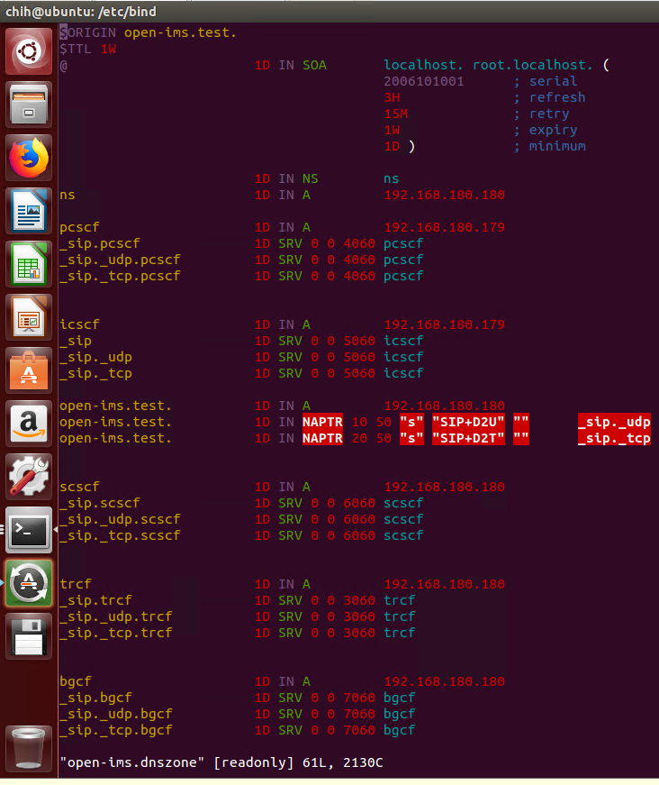
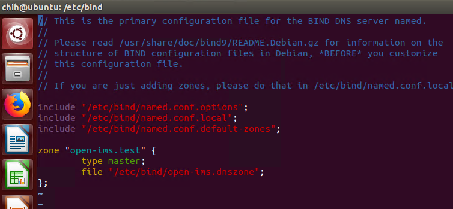
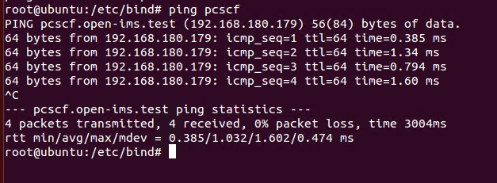

# OpenIMS-note

## 1. 前置作業
### 安裝套件 & 更新
```=bash
sudo apt-get install subversion ant default-jre default-jdk bison flex mysql-server libmysqlclient-dev libxml2 libxml2-dev bind9 ipsec-tools libcurl4-openssl-dev libgstreamer0.10-dev gstreamer0.10-plugins-farsight gstreamer0.10-plugins-bad libgstreamer-plugins-base0.10-dev -y
sudo apt-get update -y
sudo apt-get upgrade -y
sudo apt-get dist-upgrade -y
```
### 修改權限與建立資料夾
```=bash
mkdir /opt/OpenIMSCore
cd /opt/OpenIMSCore
mkdir ser_ims
mkdir FHoSS
sudo chmod 777 -R /opt 
```

### 下載檔案 ser_ims (CSCF) & FHoSS (HSS)
```
svn checkout https://svn.code.sf.net/p/openimscore/code/ser_ims/trunk ser_ims
svn checkout https://svn.code.sf.net/p/openimscore/code/FHoSS/trunk FHoSS
```

### compile
```=bash
cd /opt/OpenIMSCore/ser_ims
sudo make install-libs all
cd ..

cd /opt/OpenIMSCore/FHoSS
ant compile
ant deploy
cd ..
```


## 2. 網路設定 (DNS)
```
local_IP=<自己的IP>

sudo cp ser_ims/cfg/open-ims.dnszone /etc/bind
```

### 改IP /etc/bind/open-ims.dnszone
```
cd /etc/bind
sed -i "s/127.0.0.1/${local_IP}/g" open-ims.dnszone
```


### 新增內容 /etc/bind/named.conf
```
cd /etc/bind
echo "zone \"open-ims.test\" {
        type master;
        file \"/etc/bind/open-ims.dnszone\";
};
" >> named.conf
```


### 修改內容 /etc/resolv.conf
```
cd /etc
echo "search open-ims.test" >> resolv.conf
echo "nameserver ${local_IP}" >> resolv.conf
echo "domain open-ims.test" >> resolv.conf
```


### 使用內建的sh檔案修改
```
cd /opt/OpenIMSCore/ser_ims/cfg
sudo sh configurator.sh
# Domain Name: <your.domain.name>
# IP Address: <your.IP.address>
# File to change [“all” for everything, “exit” to quit]: all
```

### change .xml and .sql file
```
cd /opt/OpenIMSCore/FHoSS/deploy/
sed -i "s/127.0.0.1/${local_IP}/g" DiameterPeerHSS.xml

cd /opt/OpenIMSCore/FHoSS/scripts/
sed -i "s/127.0.0.1/${local_IP}/g" userdata.sql

cd /opt/OpenIMSCore/FHoSS/config/
sed -i "s/127.0.0.1/${local_IP}/g" DiameterPeerHSS.xml
```

### restart bind9
```
sudo /etc/init.d/bind9 restart
```


### TEST
```
ping pcscf
```



## 運行OpenIMS

### MySQL設定
```
mysql -u root -p -h localhost < /opt/OpenIMSCore/ser_ims/cfg/icscf.sql
mysql -u root -p -h localhost < /opt/OpenIMSCore/FHoSS/scripts/hss_db.sql
mysql -u root -p -h localhost < /opt/OpenIMSCore/FHoSS/scripts/userdata.sql
```

### copy files
```
cd /opt/OpenIMSCore
cp ser_ims/cfg/*.cfg ./
cp ser_ims/cfg/*.xml ./
cp ser_ims/cfg/*.sh ./
```

### RUNNING
```
cd /opt/OpenIMSCore

# HSS
./fhoss.sh

# I-CSCF
./icscf.sh

# S-CSCF
./scscf.sh

# P-CSCF
./pcscf.sh
```

- 💡 If error occur. Can not find /bin/java => 如果無法執行可以稍微改一下
    ```
    sudo ln –s /usr/bin/java /bin/java
    ```